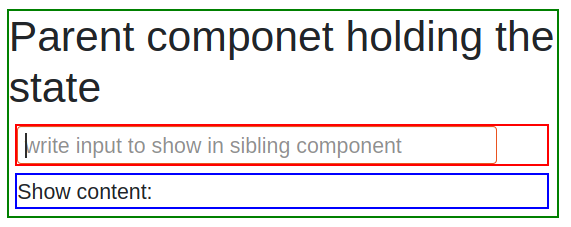

# React dag 3

- [Lifting state up](https://reactjs.org/docs/lifting-state-up.html)
- [Example code](LiftingState.js)
- [Asyncrone server kald]()
  - GET, POST, PUT, DELETE
- [Async-Await](https://hackernoon.com/6-reasons-why-javascripts-async-await-blows-promises-away-tutorial-c7ec10518dd9)