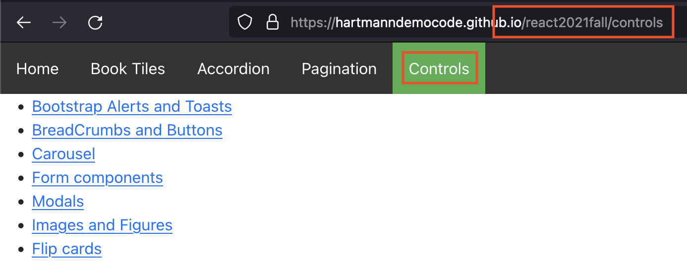

# React routing
[Documentation](https://reactrouter.com/web/guides/quick-start)

- Benefits of routing in SPA
    - bookmark
    - history
    - navigation clarity (visible path in url)
- BrowserRouter vs HashRouter
- Url parameters with useParams()
- Nested routing (sub routes)
- No Match component (404)
[Class exercise](https://docs.google.com/document/d/1XhNR0wlyeIQHrm8TZslzHVtub4WltW56oCti8Kn4a4M/edit?usp=sharing)
## Conditional rendering
- [documentation](https://reactjs.org/docs/conditional-rendering.html)
```jsx
<div>
      <h1>Hello!</h1>
        {unreadMessages.length > 0 &&        
        <h2>You have {unreadMessages.length} unread messages.</h2>      
        }
</div>
```
**Class Exercise:** 
- create a component that gets an array from a jsonserver
- Render a table with the data
- Make conditional rendering on the the table head (so that only column names are shown if there is any data to show).
## Debugging
Extensions:
- [Chrome](https://chrome.google.com/webstore/detail/react-developer-tools/fmkadmapgofadopljbjfkapdkoienihi?hl=en)
- [Firefox](https://addons.mozilla.org/en-US/firefox/addon/react-devtools/)
- [How to use](https://hacks.mozilla.org/2017/07/debug-react-redux-firefox-add-ons/)

## Bootstrap
- [Live example](https://edu.bugelhartmann.dk/react2021fall/flipCards)
- [Github](https://github.com/HartmannDemoCode/react2021fall/)

## Deployment
[Small guide to deploy react browser router to nginx on sub location](deploy_react_router.md)