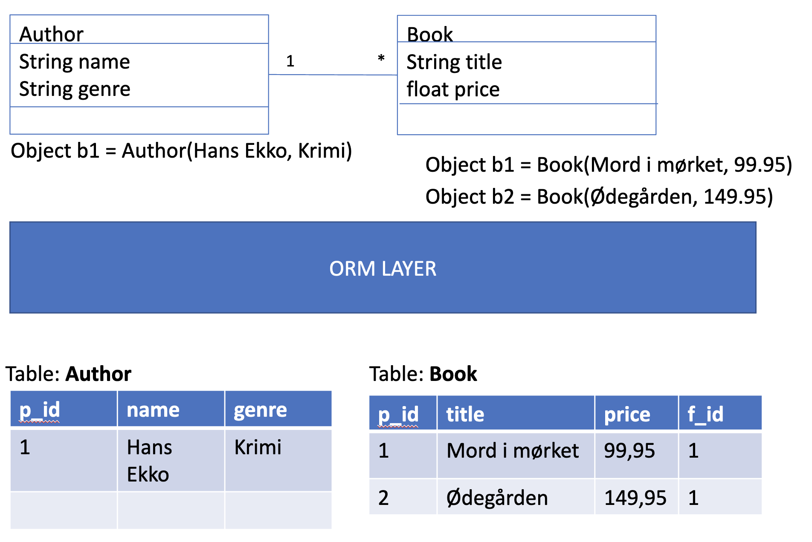

# Day 2 Relationships


## Relationship types
1. @OneToOne
2. @OneToMany
3. @ManyToMany

They can ALL be either Uni-Directional or By-Directional

### Example code
##### @OneToOne
```Java
@OneToOne(cascade = CascadeType.PERSIST)
    private Address address;
```
##### @OneToMany
Both sides are annotated if bi-directional otherwise only the side with the collection is annotated with @OneToMany

```Java
@OneToMany(mappedBy = "parent") //Do not use CascadeTypes here, because Children has other non-identifying relationships.
    private Map<Child> children;
```
And the other side in a BI-directional relationship (the **OWNING** side)
```Java
@ManyToOne
    @JoinColumn(name = "parent_id", referencedColumnName = "id")//, nullable = false)
    private Parent parent;
```
##### @ManyToMany
Many to many relationship between children and toys:

```Java
@ManyToMany(mappedBy = "children") //Target side of relationsship (inverse side)
private List<Toy> toys;
```
and the owning side:
```java
@ManyToMany(cascade = CascadeType.ALL)
@JoinTable( // This is now the owner side of the relationsship
    name = "children_toys",
    joinColumns = @JoinColumn(name = "child_id"),
    inverseJoinColumns = @JoinColumn(name = "toy_id"))
private List<Child> children;
```

## Cascade types
BE CAREFUL with these
They can be useful, but dont use them to fix problems. Rather understand why the problem appears and fix it without cascading while training with JPA.
- Never use cascade ALL or cascade DELETE in ManyToMany relationships
- Only use cascade type ALL when operating on an entity with an **indentifying** relationship to another
## Adders and Removes
Important in bi-directional relationships. Put these methods in Entity Classes, that have bidirectional relations
### Adder method
Think about use cases: What operations must be supported? Adding and removing a toy from a tool? The other way around? or both cases are possible?

Tools and Toys (ManyToMany):
```java
public void addToy(Toy t) {
    this.toys.add(t);
    if(!t.getTools().contains(this))
        t.getTools().add(this);
}
```
### Remover method
```java
public void removeToy(Toy t) {
    this.toys.remove(t);
    if(t.getTools().contains(this))
        t.getTools().remove(this);
}
```
